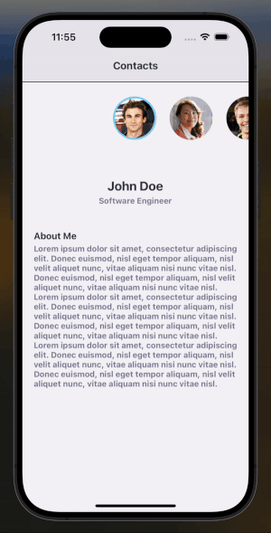

# contacts-ui

A React Native mobile UI that contains a contacts screen and uses context state management.



## Setup

-   Install the project dependencies via npm or yarn:

```
yarn install
```

-   Install Ruby dependencies mentioned in the Gemfile:

```
bundle install
```

-   This installs CocoaPods which is required for iOS.

-   Navigate to the iOS directory and install pods:

```
cd ios && pod install
```

-   Navigate to the project root and start the Metro bundler:

```
yarn start
```

-   Launch the app in your iOS simulator or Android emulator.

## Tech Stack

-   TypeScript
-   React Native
-   Context API
